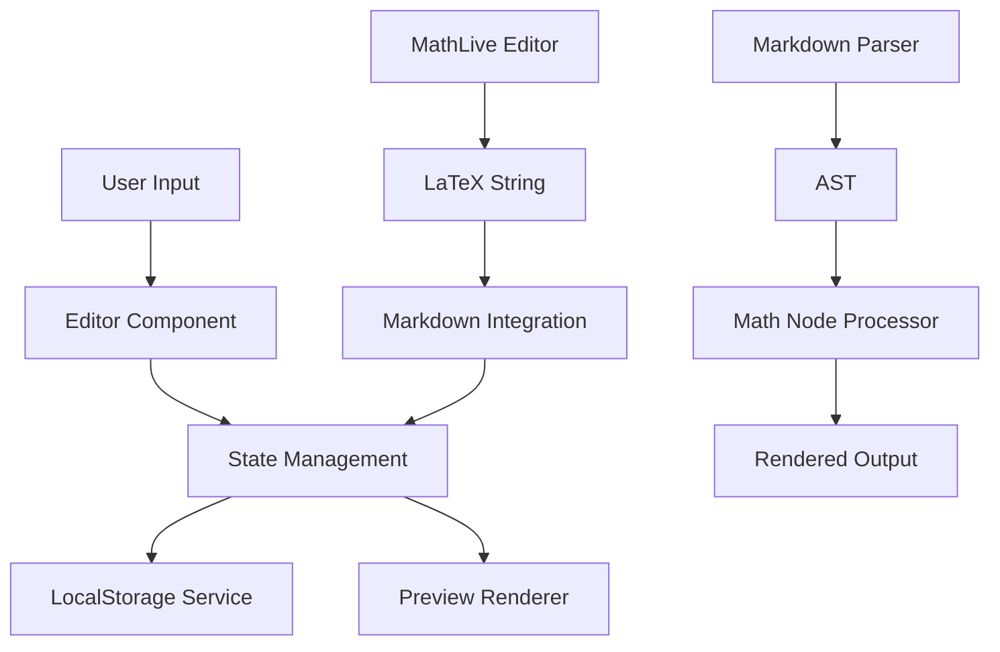

# Design Document

## Overview

MathLive対応Markdownメモ帳は、React + TypeScript + Viteをベースとしたシングルページアプリケーション（SPA）です。MathLiveライブラリを統合してリッチな数式入力体験を提供し、Markdownレンダリングエンジンと組み合わせることで、学術的なメモ作成に最適化されたツールを実現します。

### Key Technologies
- **Frontend**: React 19 + TypeScript
- **Build Tool**: Vite
- **Math Input**: MathLive (https://cortexjs.io/mathlive/)
- **Markdown Processing**: react-markdown + remark/rehype plugins
- **Math Rendering**: KaTeX (MathLiveと統合)
- **Storage**: Browser LocalStorage
- **Styling**: CSS Modules + CSS Variables

## Architecture

### Component Architecture

```
App
├── Layout
│   ├── Header (タイトル、メニュー)
│   ├── Sidebar (メモ一覧、ナビゲーション)
│   └── MainContent
│       ├── NoteEditor
│       │   ├── MarkdownEditor
│       │   ├── MathLiveIntegration
│       │   └── EditorToolbar
│       └── PreviewPane
│           ├── MarkdownRenderer
│           └── MathRenderer
└── Modals
    ├── NoteListModal
    ├── ExportModal
    └── ConfirmDeleteModal
```

### Data Flow Architecture



## Components and Interfaces

### Core Components

#### 1. NoteEditor Component
```typescript
interface NoteEditorProps {
  note: Note;
  onNoteChange: (note: Note) => void;
  onSave: () => void;
}

interface EditorState {
  content: string;
  cursorPosition: number;
  isEditing: boolean;
  mathEditMode: boolean;
}
```

#### 2. MathLiveIntegration Component
```typescript
interface MathLiveIntegrationProps {
  initialValue?: string;
  onMathChange: (latex: string) => void;
  onComplete: () => void;
  position: { x: number; y: number };
}

interface MathFieldConfig {
  virtualKeyboardMode: 'manual' | 'onfocus' | 'off';
  smartMode: boolean;
  inlineShortcuts: Record<string, string>;
}
```

#### 3. MarkdownRenderer Component
```typescript
interface MarkdownRendererProps {
  content: string;
  onMathClick: (latex: string, position: DOMRect) => void;
}

interface RenderOptions {
  remarkPlugins: Plugin[];
  rehypePlugins: Plugin[];
  components: Record<string, ComponentType>;
}
```

#### 4. NoteManager Service
```typescript
interface NoteManagerService {
  createNote(): Note;
  saveNote(note: Note): Promise<void>;
  loadNote(id: string): Promise<Note>;
  deleteNote(id: string): Promise<void>;
  listNotes(): Promise<Note[]>;
  exportNote(note: Note, format: ExportFormat): Promise<Blob>;
}
```

### Data Models

#### Note Model
```typescript
interface Note {
  id: string;
  title: string;
  content: string;
  createdAt: Date;
  updatedAt: Date;
  tags?: string[];
}

interface NoteMetadata {
  id: string;
  title: string;
  createdAt: Date;
  updatedAt: Date;
  wordCount: number;
  mathCount: number;
}
```

#### Math Integration Model
```typescript
interface MathNode {
  id: string;
  latex: string;
  position: {
    start: number;
    end: number;
  };
  display: 'inline' | 'block';
}

interface MathContext {
  nodes: MathNode[];
  activeNode?: string;
  editMode: boolean;
}
```

## Error Handling

### Error Types and Handling Strategy

#### 1. Storage Errors
```typescript
class StorageError extends Error {
  constructor(message: string, public operation: 'save' | 'load' | 'delete') {
    super(message);
  }
}

// Handling Strategy:
// - Show user-friendly error messages
// - Implement retry mechanism
// - Fallback to in-memory storage
```

#### 2. Math Rendering Errors
```typescript
class MathRenderError extends Error {
  constructor(message: string, public latex: string) {
    super(message);
  }
}

// Handling Strategy:
// - Display error placeholder in preview
// - Highlight problematic LaTeX in editor
// - Provide correction suggestions
```

#### 3. Export Errors
```typescript
class ExportError extends Error {
  constructor(message: string, public format: ExportFormat) {
    super(message);
  }
}

// Handling Strategy:
// - Show detailed error message
// - Offer alternative export formats
// - Log error details for debugging
```

### Error Boundary Implementation
```typescript
interface ErrorBoundaryState {
  hasError: boolean;
  error?: Error;
  errorInfo?: ErrorInfo;
}

class AppErrorBoundary extends Component<PropsWithChildren, ErrorBoundaryState> {
  // Catch and handle React component errors
  // Provide fallback UI
  // Log errors for debugging
}
```

## Testing Strategy

### Unit Testing
- **Components**: React Testing Library + Jest
- **Services**: Jest with mocked dependencies
- **Utilities**: Pure function testing
- **Math Integration**: MathLive API testing

### Integration Testing
- **Editor-Preview Sync**: Test real-time updates
- **Storage Operations**: Test CRUD operations
- **Math Rendering Pipeline**: Test LaTeX → Display flow
- **Export Functionality**: Test file generation

### E2E Testing (Optional)
- **User Workflows**: Playwright or Cypress
- **Cross-browser Compatibility**: Basic smoke tests
- **Mobile Responsiveness**: Viewport testing

### Test Coverage Goals
- Components: 80%+ coverage
- Services: 90%+ coverage
- Critical paths: 100% coverage

## Performance Considerations

### Optimization Strategies

#### 1. Rendering Performance
- **Virtual Scrolling**: For large note lists
- **Debounced Updates**: Preview rendering (300ms delay)
- **Memoization**: React.memo for expensive components
- **Code Splitting**: Lazy load MathLive bundle

#### 2. Storage Performance
- **Batch Operations**: Group multiple saves
- **Compression**: LZ-string for large notes
- **Indexing**: Fast note search and filtering
- **Cleanup**: Remove orphaned data

#### 3. Math Rendering Performance
- **Caching**: Rendered math expressions
- **Progressive Loading**: Load math incrementally
- **Worker Threads**: Heavy math processing
- **Precompilation**: Common expressions

### Bundle Size Optimization
```typescript
// Dynamic imports for large dependencies
const MathLive = lazy(() => import('./components/MathLiveEditor'));
const ExportModal = lazy(() => import('./components/ExportModal'));

// Tree shaking configuration
// Minimize MathLive bundle size
// Use production builds
```

## Security Considerations

### Input Sanitization
- **Markdown Content**: Sanitize HTML output
- **LaTeX Input**: Validate math expressions
- **File Names**: Sanitize export file names
- **XSS Prevention**: Escape user content

### Data Protection
- **Local Storage**: No sensitive data exposure
- **Export Security**: Safe file generation
- **Content Validation**: Prevent malicious input

### Privacy
- **No External Requests**: Fully offline operation
- **No Analytics**: No user tracking
- **Local-only Storage**: Data never leaves device
##
 Implementation Details

### MathLive Integration Strategy

#### 1. Installation and Setup
```bash
npm install mathlive
npm install @types/mathlive
npm install react-markdown remark-math rehype-katex
npm install katex @types/katex
```

#### 2. MathLive Configuration
```typescript
// MathLive global configuration
import { MathfieldElement } from 'mathlive';

MathfieldElement.fontsDirectory = '/fonts/';
MathfieldElement.soundsDirectory = '/sounds/';

const mathfieldConfig = {
  virtualKeyboardMode: 'manual',
  smartMode: true,
  inlineShortcuts: {
    'alpha': '\\alpha',
    'beta': '\\beta',
    'gamma': '\\gamma',
    'sum': '\\sum',
    'int': '\\int',
    'frac': '\\frac{#@}{#?}',
    'sqrt': '\\sqrt{#@}',
  },
};
```

#### 3. React Integration Pattern
```typescript
// Custom hook for MathLive integration
const useMathField = (initialValue: string) => {
  const mathfieldRef = useRef<MathfieldElement>(null);
  
  useEffect(() => {
    if (mathfieldRef.current) {
      mathfieldRef.current.value = initialValue;
    }
  }, [initialValue]);
  
  return {
    mathfieldRef,
    getValue: () => mathfieldRef.current?.value || '',
    setValue: (value: string) => {
      if (mathfieldRef.current) {
        mathfieldRef.current.value = value;
      }
    }
  };
};
```

### Markdown Processing Pipeline

#### 1. Parser Configuration
```typescript
import remarkMath from 'remark-math';
import rehypeKatex from 'rehype-katex';
import remarkGfm from 'remark-gfm';

const markdownOptions = {
  remarkPlugins: [remarkGfm, remarkMath],
  rehypePlugins: [rehypeKatex],
  components: {
    // Custom math component for click handling
    span: ({ className, children, ...props }) => {
      if (className?.includes('katex')) {
        return (
          <span 
            className={className} 
            onClick={handleMathClick}
            {...props}
          >
            {children}
          </span>
        );
      }
      return <span className={className} {...props}>{children}</span>;
    }
  }
};
```

#### 2. Math Detection and Extraction
```typescript
// Utility to find math expressions in markdown
const extractMathExpressions = (content: string): MathNode[] => {
  const mathRegex = /\$\$([^$]+)\$\$|\$([^$]+)\$/g;
  const nodes: MathNode[] = [];
  let match;
  
  while ((match = mathRegex.exec(content)) !== null) {
    nodes.push({
      id: generateId(),
      latex: match[1] || match[2],
      position: {
        start: match.index,
        end: match.index + match[0].length
      },
      display: match[1] ? 'block' : 'inline'
    });
  }
  
  return nodes;
};
```

### Storage Architecture

#### 1. LocalStorage Service
```typescript
class LocalStorageService implements StorageService {
  private readonly NOTES_KEY = 'math-notepad-notes';
  private readonly METADATA_KEY = 'math-notepad-metadata';
  
  async saveNote(note: Note): Promise<void> {
    try {
      const notes = await this.loadAllNotes();
      const index = notes.findIndex(n => n.id === note.id);
      
      if (index >= 0) {
        notes[index] = note;
      } else {
        notes.push(note);
      }
      
      localStorage.setItem(this.NOTES_KEY, JSON.stringify(notes));
      await this.updateMetadata(note);
    } catch (error) {
      throw new StorageError('Failed to save note', 'save');
    }
  }
  
  async loadNote(id: string): Promise<Note> {
    try {
      const notes = await this.loadAllNotes();
      const note = notes.find(n => n.id === id);
      
      if (!note) {
        throw new StorageError(`Note ${id} not found`, 'load');
      }
      
      return note;
    } catch (error) {
      throw new StorageError('Failed to load note', 'load');
    }
  }
}
```

### Responsive Design Strategy

#### 1. Breakpoint System
```css
:root {
  --breakpoint-mobile: 768px;
  --breakpoint-tablet: 1024px;
  --breakpoint-desktop: 1200px;
}

/* Mobile-first approach */
.layout {
  display: flex;
  flex-direction: column;
}

@media (min-width: 768px) {
  .layout {
    flex-direction: row;
  }
  
  .sidebar {
    width: 300px;
    min-width: 250px;
  }
}
```

#### 2. Touch Optimization
```typescript
// Touch-friendly math input
const MathTouchInput = () => {
  const [touchMode, setTouchMode] = useState(false);
  
  useEffect(() => {
    const isTouchDevice = 'ontouchstart' in window;
    setTouchMode(isTouchDevice);
  }, []);
  
  return (
    <math-field
      virtual-keyboard-mode={touchMode ? 'onfocus' : 'manual'}
      virtual-keyboard-theme="material"
    />
  );
};
```

### Export System Design

#### 1. Export Formats
```typescript
interface ExportFormat {
  type: 'markdown' | 'html' | 'pdf';
  options: ExportOptions;
}

interface ExportOptions {
  includeMetadata: boolean;
  mathFormat: 'latex' | 'mathml' | 'svg';
  styling: 'minimal' | 'full';
}
```

#### 2. Export Implementation
```typescript
class ExportService {
  async exportAsMarkdown(note: Note): Promise<Blob> {
    const content = `# ${note.title}\n\n${note.content}`;
    return new Blob([content], { type: 'text/markdown' });
  }
  
  async exportAsHTML(note: Note): Promise<Blob> {
    const html = await this.renderToHTML(note);
    return new Blob([html], { type: 'text/html' });
  }
  
  private async renderToHTML(note: Note): Promise<string> {
    // Use same markdown pipeline as preview
    // Include KaTeX CSS
    // Generate complete HTML document
  }
}
```